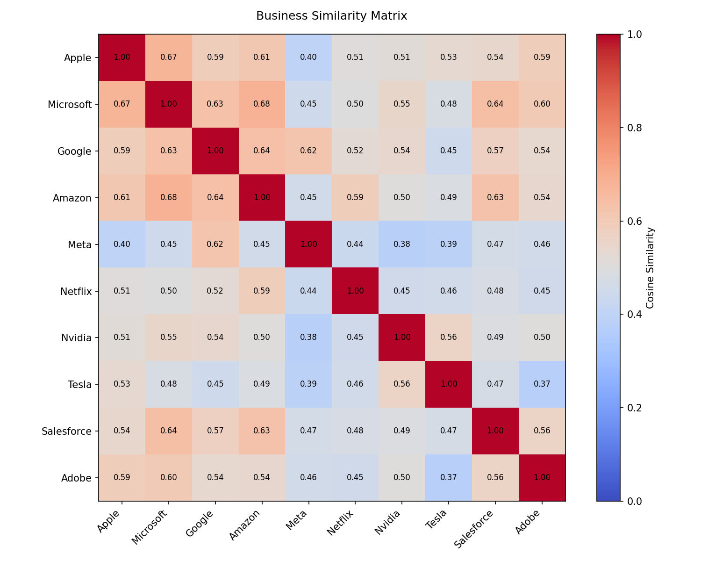

# Business Similarity Matrix

A Python tool that uses LLMs to compute pairwise business similarity across a user defined list of companies - producing a more nuanced alternative to traditional SIC codes.

## Motivation

Standard industry classification systems (SIC, GICS) assign companies to coarse discrete categories, hence losing the nuance of how businesses actually overlap. Two companies can share a SIC code but barely compete, or span multiple industries entirely. This tool generates continuous similarity scores based on the semantic content of each company's actual business model.

## How It Works

1. **Describe** — Claude (Anthropic) generates a structured business description for each company.
2. **Embed** — OpenAI's `text-embedding-3-small` model converts each description into a 1536-dimensional vector.
3. **Compare** — Cosine similarity is computed between every pair of vectors, producing a similarity matrix.

## Usage

1. Add your API keys to a `.env` file:
```
ANTHROPIC_API_KEY=your-key-here
OPENAI_API_KEY=your-key-here
```

2. Edit `companies.txt` with one company name per line

3. Run:
```
python3 similarity.py
```

## Outputs

- `similarity_matrix.csv` — pairwise similarity scores for all companies
- `similarity_matrix.png` — heatmap visualisation of the matrix

## Requirements

Install dependencies with:
```
pip install -r requirements.txt
```

## Example Output



